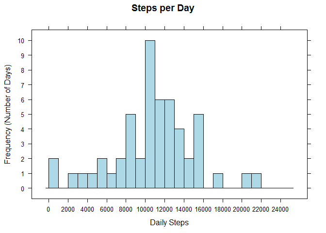
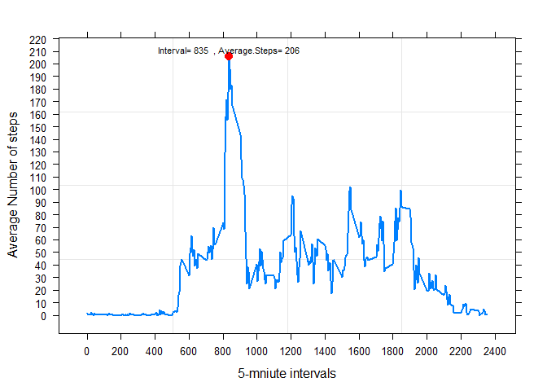
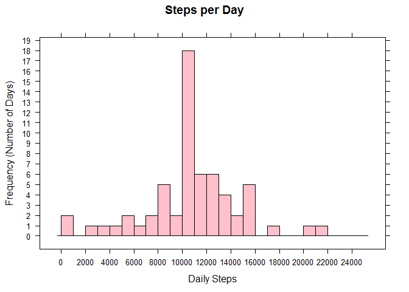
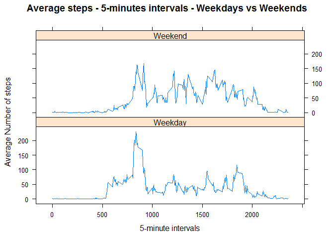
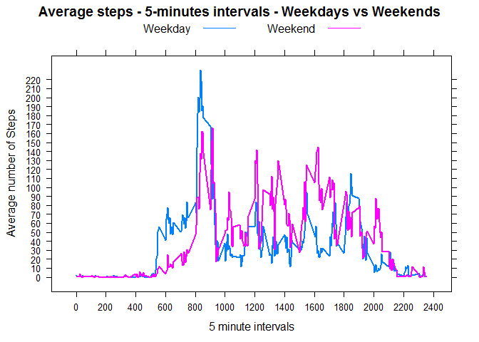

# Reproducible Research: Peer Assessment 1


## Loading and preprocessing the data


```r
setwd("~/R/RepResearch")

#Unzipped activity.zip and extracted the csv file. Now loading the  file.
DailyActivity<- read.csv("activity.csv")
str(DailyActivity)
```

```
## 'data.frame':	17568 obs. of  3 variables:
##  $ steps   : int  NA NA NA NA NA NA NA NA NA NA ...
##  $ date    : Factor w/ 61 levels "2012-10-01","2012-10-02",..: 1 1 1 1 1 1 1 1 1 1 ...
##  $ interval: int  0 5 10 15 20 25 30 35 40 45 ...
```

```r
DailyActivity$date <- as.Date(DailyActivity$date) # change date from factor to date format
DailyActivityCompleteCases <-na.omit(DailyActivity)  # Filter only completed cases
```


## What is mean total number of steps taken per day?

```r
require(lattice)    # Needed to draw the graphs
```

```
## Loading required package: lattice
```

```r
DailySteps <-aggregate(DailyActivityCompleteCases$steps,list(DailyActivityCompleteCases$date),FUN="sum")
histogram(~DailySteps$x, data=DailySteps,breaks=seq(from=0,to=25000,by=1000),type="count",scales=list(x=list(at=seq(from=0,to=25000,by=2000)),y=list(at=seq(from=0,to=30,by=1))),main = "Steps per Day",xlab="Daily Steps",ylab="Frequency (Number of Days)",col="lightblue")
```

<!-- -->

### Mean

```r
mean(DailySteps$x)
```

```
## [1] 10766.19
```
### Median

```r
median(DailySteps$x)
```

```
## [1] 10765
```


## What is the average daily activity pattern?

```r
DailyStepsInterval <-aggregate(x=DailyActivityCompleteCases$steps,by=list(DailyActivityCompleteCases$interval),FUN="mean")

#Find maximum steps
MaxSteps <-as.numeric(format(round(DailyStepsInterval[which.max(DailyStepsInterval$x),"x"],0),big.mark=",",nsmall=0))
#Find interval with the maximum steps
MaxStepsInterval <-DailyStepsInterval[which.max(DailyStepsInterval$x),"Group.1"]

customPanel <- function(x,y,...) {
  
  panel.grid()
  panel.xyplot(x,y,lwd=2,...)
  panel.points(MaxStepsInterval,MaxSteps, pch=16, cex=1.2, col="red")
  panel.text(MaxStepsInterval,MaxSteps+5,paste("Interval=" ,MaxStepsInterval, " , Average.Steps=",MaxSteps),cex=.7)
  
}


xyplot(x ~ Group.1, data=DailyStepsInterval, type="l",  ylab="Average Number of steps", xlab="5-mniute intervals",scales=list(x=list(at=seq(from=0,to=2400,by=200)),y=list(at=seq(from=0,to=220,by=10))),panel=customPanel ) 
```

<!-- -->

### Interval with maximum average steps

```r
MaxStepsInterval
```

```
## [1] 835
```

## Imputing missing values

```r
CleansedDailyActivity <- as.data.frame(DailyActivity)
## Replace Missing values with mean of interval 
for (i in 1:nrow(CleansedDailyActivity)) {
if (is.na(CleansedDailyActivity[i,"steps"])) {
 j<- CleansedDailyActivity[i,"interval"]    #Find interval to be searched
k <- DailyStepsInterval[DailyStepsInterval$Group.1 == j, "x"] #"Find the average steps for the interval"
CleansedDailyActivity[i,"steps"] <- k # Replace NA with the average steps
}
}

CleansedDailySteps<- aggregate(CleansedDailyActivity$steps, by = list(CleansedDailyActivity$date), sum, na.rm = TRUE)
names(CleansedDailySteps)<- c("date","steps")
histogram(~CleansedDailySteps$steps, data=CleansedDailySteps,breaks=seq(from=0,to=25000,by=1000),type="count",scales=list(x=list(at=seq(from=0,to=25000,by=2000)),y=list(at=seq(from=0,to=50,by=1))),main = "Steps per Day",xlab="Daily Steps",ylab="Frequency (Number of Days)",col="pink")
```

<!-- -->

### Mean

```r
mean(CleansedDailySteps$steps)
```

```
## [1] 10766.19
```

### Median


```r
median(CleansedDailySteps$steps)
```

```
## [1] 10766.19
```
### Since the mean of interval was used to replace missing values the overall mean will not change significantly from the original data set.

## Are there differences in activity patterns between weekdays and weekends?


```r
# Create column to show weekday
CleansedDailyActivity$Weekday <- weekdays(CleansedDailyActivity$date)
# separate weekdays and weekends into separate data frames
weekdays <- CleansedDailyActivity[CleansedDailyActivity$Weekday != "Saturday" & CleansedDailyActivity$Weekday != "Sunday",]
weekends <- CleansedDailyActivity[CleansedDailyActivity$Weekday == "Saturday" | CleansedDailyActivity$Weekday == "Sunday",]
#calculate the average for each interval  for weekend and weekdays
weekdayMeans <-aggregate(weekdays$steps,by=list(weekdays$interval), FUN=mean)
weekendMeans <-aggregate(weekends$steps,by=list(weekends$interval), FUN=mean)
weekdayMeans$group <- "Weekday"
weekendMeans$group <- "Weekend"
# combine to a single data frame
 CleansedDailyActivityWeekdays<- rbind(weekdayMeans,weekendMeans)
 
 xyplot(x ~ Group.1 | group, data=CleansedDailyActivityWeekdays, type="l",  layout=c(1,2), ylab="Average Number of steps", xlab="5-minute intervals", main="Average steps - 5-minutes intervals - Weekdays vs Weekends")
```

<!-- -->
 
 

 
 
 
 ```r
 xyplot(x ~ Group.1 , data=CleansedDailyActivityWeekdays, type="l",lwd=2,  groups=group,auto.key=list(lines=TRUE,points=FALSE,columns=2), ylab="Average number of Steps", xlab="5 minute intervals", main="Average steps - 5-minutes intervals - Weekdays vs Weekends",scales=list(x=list(at=seq(from=0,to=2400,by=200)),y=list(at=seq(from=0,to=220,by=10))))
 ```
 
 <!-- -->

### Grouping the points  for weekeend and weekday together we can see that during weekdays there are more steps in the mornings and fewer  steps most of the time during the rest of the day compared to weekends.During the evening there is an increase in steps on weekdays
